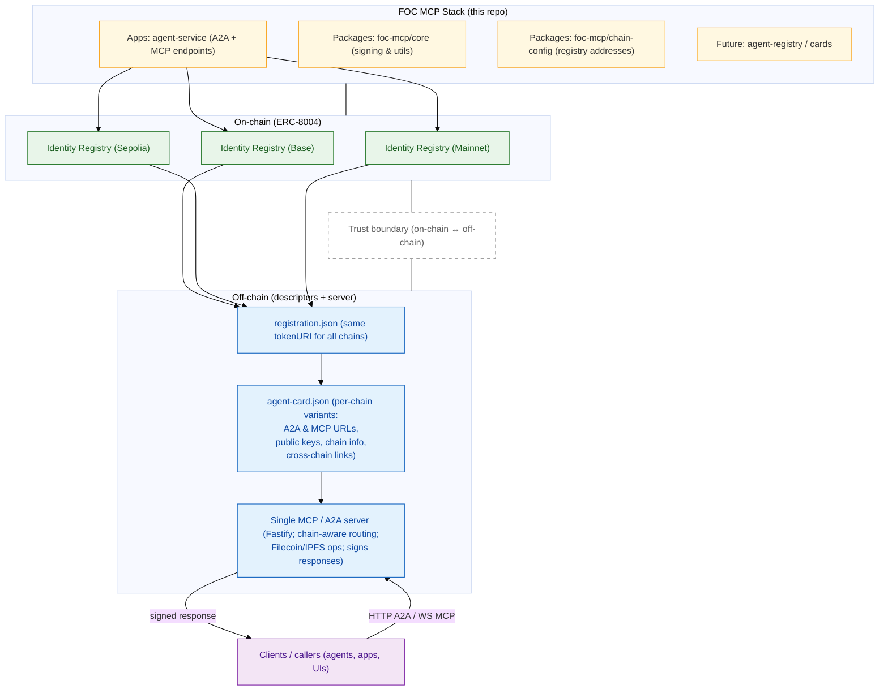

# FOC MCP Stack

A **Filecoin On-Chain Cloud (FOC)** agent framework implementing **ERC-8004** for multi-chain agent identity and **MCP/A2A** protocols for Filecoin/IPFS operations.

## 🚀 Quick Start

```bash
# Install dependencies
pnpm install

# Start the development server
pnpm dev

# Test the endpoints
curl http://localhost:3000/health
curl http://localhost:3000/.well-known/agent-card.json
```

## Architecture



## 📁 Project Structure

```
foc-mcp-stack/
├── apps/
│   └── agent-service/          # Main MCP/A2A server
│       ├── src/
│       │   ├── server.ts       # Fastify server bootstrap
│       │   ├── routes/         # HTTP/WebSocket routes
│       │   │   ├── wellKnown.ts # Agent card endpoints
│       │   │   ├── a2a.ts      # A2A RPC methods
│       │   │   └── mcp.ts      # MCP WebSocket handler
│       │   ├── handlers/       # Business logic (TODO)
│       │   ├── middleware/     # Auth, rate limiting (TODO)
│       │   ├── schemas/        # Request/response schemas (TODO)
│       │   ├── signing/        # Response signing
│       │   └── utils/          # Helper functions (TODO)
│       └── package.json
├── packages/
│   ├── chain-config/           # Chain configurations
│   └── foc-core/              # Core types and utilities
├── deployments/
│   ├── cards/                 # Agent card JSON files
│   └── registration/          # ERC-8004 registration files
└── scripts/
    └── build-cards.ts         # Agent card builder
```

## 🛠️ Development

### Prerequisites

- Node.js 18+
- pnpm 9+

### Setup

1. **Clone and install:**
   ```bash
   git clone <repo-url>
   cd foc-mcp-stack
   pnpm install
   ```

2. **Configure environment:**
   ```bash
   cp apps/agent-service/env.example apps/agent-service/.env
   # Edit .env with your configuration
   ```

3. **Start development server:**
   ```bash
   pnpm dev
   ```

### Available Scripts

- `pnpm dev` - Start development server
- `pnpm build` - Build all packages
- `pnpm typecheck` - Type check all packages
- `pnpm lint` - Lint all packages

## 🌐 API Endpoints

### Health Check
```bash
GET /health
```

### Agent Card (ERC-8004)
```bash
GET /.well-known/agent-card.json
GET /.well-known/agent-card-{chain}.json
```

### A2A RPC
```bash
POST /a2a
Content-Type: application/json

{
  "method": "echo",
  "params": { "test": "hello" },
  "chainId": 84532,
  "agentId": "1"
}
```

### MCP WebSocket
```bash
WS /mcp
```

## 🔧 Configuration

### Environment Variables

```bash
# Server
PORT=3000
HOST=0.0.0.0
LOG_LEVEL=info
PUBLIC_URL=http://localhost:3000

# Agent Signing
SIGNER_PK=0x...  # Private key for signing responses

# RPC Endpoints
RPC_base-sepolia=https://sepolia.base.org
RPC_sepolia=https://sepolia.infura.io/v3/YOUR_KEY
```

### Supported Chains

- **Base Sepolia** (84532)
- **Sepolia** (11155111)
- **Base** (8453)
- **Ethereum Mainnet** (1)

## 📋 A2A Methods

| Method | Description | Status |
|--------|-------------|--------|
| `echo` | Test endpoint | ✅ |
| `agent.info` | Agent information | ✅ |
| `pin.add` | Pin CID to IPFS | 🚧 |
| `pin.status` | Check pin status | 🚧 |
| `index.run` | Start indexing job | 🚧 |
| `index.status` | Check index status | 🚧 |
| `verify.proof` | Verify Filecoin proof | 🚧 |

## 🔌 MCP Tools

| Tool | Description | Status |
|------|-------------|--------|
| `pin_add` | Add CID to pinning service | 🚧 |
| `pin_status` | Get pin status | 🚧 |

## 🏗️ Building Agent Cards

```bash
# Build agent card for a specific chain
pnpm tsx scripts/build-cards.ts \
  --chain base-sepolia \
  --agentId 1 \
  --registry 0xREGISTRY_ADDR \
  --owner 0xOWNER_ADDR \
  --publicKey 0x04YOUR_PUBKEY \
  --publicUrl https://your-domain.com \
  --out deployments/cards/agent-card-base-sepolia.json
```

## 🔐 Security

- All responses are signed with the agent's private key
- Timestamp validation prevents replay attacks
- Chain-specific routing ensures proper isolation
- Rate limiting (TODO)

## 🚧 Roadmap

- [ ] Implement actual Filecoin/IPFS operations
- [ ] Add proper ECDSA signing with secp256k1
- [ ] ERC-8004 registry integration
- [ ] Rate limiting and authentication
- [ ] Monitoring and observability
- [ ] Docker deployment
- [ ] CI/CD pipeline

## 📚 References

- [ERC-8004: On-Chain Agent Identity and Discovery](https://eips.ethereum.org/EIPS/eip-8004)
- [Machine Communication Protocol (MCP)](https://specs.agentprotocol.org/mcp/)
- [Filecoin Project](https://filecoin.io)
- [IPFS / libp2p](https://libp2p.io)

## 📄 License

MIT License - see [LICENSE](LICENSE) file.

## 👥 Contributing

1. Fork the repository
2. Create a feature branch
3. Make your changes
4. Add tests if applicable
5. Submit a pull request

---

**Maintainer:** Russell Dempsey (@sgtpooki)
**Filecoin / IPFS ecosystem developer**
